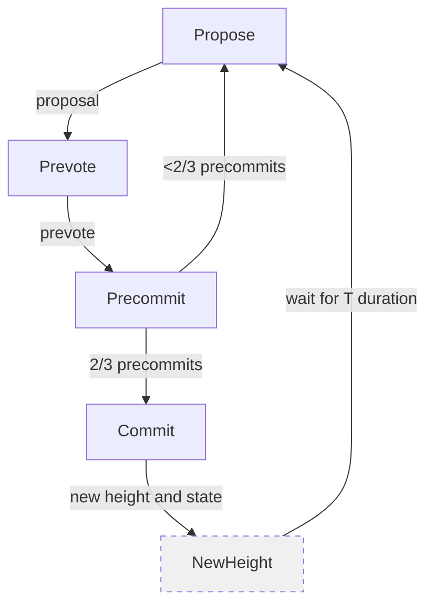
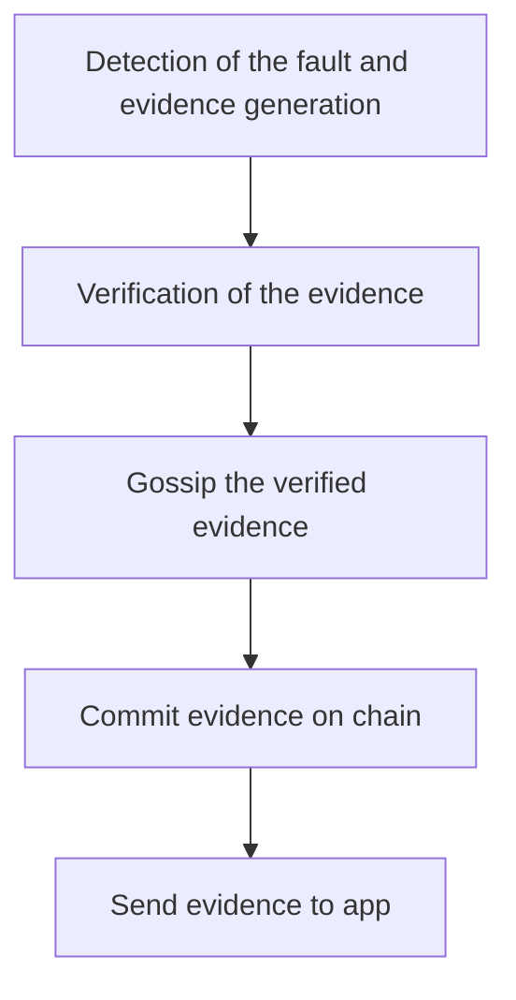

# Consensus Protocols

## Algorand Notes

### Introduction

Algorand is a new cryptocurrency designed to confirm transactions on the order of one minute. The core of Algorand uses a Byzantine agreement protocol
called BA⋆ that scales to many users, which allows Algorand to reach consensus on a new block with low latency and without the possibility of forks. A key technique that makes BA⋆ suitable for Algorand is the use of verifiable random functions (VRFs) to randomly select users in a private and non-interactive way.

Algorand faces three challenges. 
- Algorand must avoid Sybil attacks, where an adversary creates many pseudonyms to influence the Byzantine agreement protocol.
- BA⋆ must scale to millions of users, which is far higher than the scale at which state-of-the-art Byzantine agreement protocols operate.
- Algorand must be resilient to denial-of-service attacks, and continue to operate even if an adversary disconnects some of the users.

To face this, Algorand uses the following techniques:

**Weighted users:** To prevent Sybil attacks, Algorand assigns a weight to each user. In Algorand, the users have a weigh based on the money in their account. Thus, as long as more than some fraction (over 2/3) of the money is owned by honest users, Algorand can avoid forks and double-spending.

**Consensus by committee:** BA⋆ achieves scalability by
choosing a committee (a small set of representatives randomly selected from the total set of users) to run each step of its protocol. BA⋆ chooses committee members randomly among all users based on the users’ weights. This allows Algorand to ensure that a sufficient fraction of committee members are honest.

**Cryptographic sortition:** To prevent an adversary from targeting committee members, BA⋆ selects committee members in a private and non-interactive way. This means that every user in the system can independently determine if they are chosen to be on the committee, by computing a function of their private key and public information from the blockchain. If the function indicates that the user is chosen, it proves to other users that is a committee member. Since membership selection is non-interactive, an adversary does not know which user to target until that user starts participating in BA⋆.

**Participant replacement:** Finally, an adversary may target a committee member once that member sends a message in BA⋆. BA⋆ mitigates this attack by requiring committee members to speak just once. Thus, once a committee member sends his message (exposing his identity to an adversary), the committee member becomes irrelevant to BA⋆. BA⋆ achieves this property by avoiding any private state (except for the user’s private key), which makes all users equally capable of participating, and by electing new committee members for each step of the Byzantine agreement protocol.

### Related Work

**Byzantine Consensus**

Most Byzantine consensus protocols require more than
2/3 of servers to be honest, and Algorand’s BA⋆ inherits
this limitation (in the form of 2/3 of the money being held by honest users). Fixed servers are also problematic in terms of targeted attacks that either compromise the servers or disconnect them from the network. Algorand achieves better performance (confirming transactions in about a minute, reaching similar throughput) without having to choose a fixed set of servers ahead of time.

Bitcoin-NG suggests using the Nakamoto consensus to elect a leader, and then have that leader publish blocks of transactions, resulting in an order of magnitude of improvement in latency of confirming transactions over Bitcoin. Hybrid consensus refines the approach of using
the Nakamoto consensus to periodically select a group of
participants and runs a Byzantine agreement between selected participants to confirm transactions until new servers are selected. Although Hybrid consensus makes the set of Byzantine servers dynamic, it opens up the possibility of forks, due to the use of proof-of-work consensus to agree on the set of servers; this problem cannot arise in Algorand.

Pass and Shi’s paper acknowledges that the Hybrid
consensus design is secure only with respect to a “mildly
adaptive” adversary that cannot compromise the selected
servers within a day. Algorand’s BA⋆ explicitly addresses this open problem by immediately replacing any chosen committee members. As a result, Algorand is not susceptible to either targeted compromises or targeted DoS attacks.

Stellar takes an alternative approach to using Byzantine consensus in a cryptocurrency, where each user can trust
quorums of other users, forming a trust hierarchy. Consistency is ensured as long as all transactions share at least one transitively trusted quorum of users, and sufficiently many of these users are honest. Algorand avoids this assumption, which means that users do not have to make complex trust decisions when configuring their client software.

**Proof of Stake**

There is a key difference, between Algorand using monetary value as weights and many proof-of-stake cryptocurrencies. In many proof-of-stake cryptocurrencies, a malicious leader (who assembles a new block) can create a fork in the network, but if caught (e.g., since two versions of the new block are signed with his key), the leader loses his money. The weights in Algorand, however, are only to ensure that the attacker cannot amplify his power by using pseudonyms; as long as the attacker controls less than 1/3 of the monetary value, Algorand can guarantee that the probability for forks is negligible.

Ouroboros is a recent proposal for realizing proof-of-stake. For security, Ouroboros assumes that honest users can communicate within some bounded delay. Furthermore, it selects some users to participate in a joint-coin-flipping protocol and assumes that most of them are incorruptible by the adversary for a significant epoch (such as a day). In contrast Algorand assumes that the adversary may temporarily fully control the network and immediately corrupt users in targeted attacks.

**Trees and DAGs instead of chains**

GHOST, SPECTRE, and Meshcash are recent proposals for increasing Bitcoin’s throughput by replacing the underlying chainstructured ledger with a tree or directed acyclic graph (DAG) structures, and resolving conflicts in the forks of these data structures. These protocols rely on the Nakamoto consensus using proof-of-work. In contrast, Algorand is focused on eliminating forks but it would be interesting in the future.

### Goals and Assumptions

Algorand achieve two main goals allowing users to agree on an ordered log of transacions:
- Safety goal: With overwhelming probability, all users agree on the same transactions. More precisely, if one honest user accepts transaction A, then any future transactions accepted by other honest users will appear in a log that already contains A. This holds even for isolated users that are disconnected from the network.
- Liveness goal: In addition to safety, Algorand also makes progress (i.e., allows new transactions to be added to the log) under additional assumptions about network reachability. Algorand aims to reach consensus on a new set of transactions within roughly one minute.

**Assumptions**

- Honest users run bug-free software.
- The fraction of money held by honest users is above some threshold h (a constant greater than 2/3), but that an adversary can participate in Algorand and own some money. 
- An adversary can corrupt targeted users, but that an adversary cannot corrupt a large number of users that hold a significant fraction of the money.
- Algorand makes a “strong synchrony” assumption that most honest users (e.g., 95%) can send messages that will be received by most other honest users (e.g., 95%) within a known time bound.
- Algorand makes a “weak synchrony” assumption: in every period of length b (think of b as a day or a week), there must be a strongly synchronous period of length s < b (an s of a few hours suffices).
- Loosely synchronized clocks across all users in order to recover liveness after weak synchrony. Specifically, the clocks must be close enough in order for most honest users to kick off the recovery protocol at approximately the same time. If the clocks are out of sync, the recovery protocol does not succeed.

### Overview

Algorand requires each user to have a public key. Algorand maintains a log of transactions, called a blockchain. Each transaction is a payment signed by one user’s public key transferring money to another user’s public key. Algorand grows the blockchain in asynchronous rounds, similar to Bitcoin. In every round, a new block, containing a set of transactions and a pointer to the previous block, is appended to the blockchain.

Algorand users communicate through a gossip protocol.
The gossip protocol is used by users to submit new transactions. Each user collects a block of pending transactions that they hear about, in case they are chosen to propose the next block. Algorand uses BA⋆ to reach consensus on one of these pending blocks-

BA⋆ executes in steps, communicates over the same gossip protocol, and produces a new agreed-upon block. BA⋆
can produce two kinds of consensus: final consensus and
tentative consensus. If one user reaches final consensus,
this means that any other user that reaches final or tentative consensus in the same round must agree on the same block value. Thus, Algorand confirms a transaction when the transaction’s block (or any successor block) reaches final consensus. On the other hand, tentative consensus means that other users may have reached tentative consensus on a different block (as long as no user reached final consensus). A user will confirm a transaction from a tentative block only if and when a successor block reaches final consensus. The tentative consensus can be produced by an adversary if the network is strongly synchronous, in this case Algorand will reach final consensus on a successor block a few rounds later. The second case is that network was only weakly synchronous. In this case, BA⋆ can reach tentative consensus on two different blocks, forming multiple forks.  To recover liveness, Algorand periodically
invokes BA⋆ to reach consensus on which fork should be used going forward.

**How Algorands component fit together**

**Gossip protocol** Algorand implements a gossip network
(similar to Bitcoin) where each user selects a small random set of peers to gossip messages to. Every message is signed by the private key of its original sender. To avoid forwarding loops, users do not relay the same message twice. Algorand implements gossip over TCP and weighs peer selection based on how much money they have, so as to mitigate pollution attacks.

**Block proposal** All Algorand users execute cryptographic sortition to determine if they are selected to propose a block in a given round. Sortition ensures that a small fraction of users are selected at random, weighed by their account balance, and provides each selected user with a priority, which can be compared between users, and a proof of the chosen user’s priority. Since sortition is random, there may be multiple users selected to propose a block, and the priority determines which block everyone should adopt. Selected users distribute their block of pending transactions through the gossip protocol, together with their priority and proof. To ensure that users converge on one block with high probability, block proposals are prioritized based on the proposing user’s priority, and users wait for a certain amount of time to receive the block.

**Agreement using BA⋆**. To reach consensus on a single block, Algorand uses BA⋆. Each user initializes BA⋆ with the highest-priority block that they received. BA⋆ executes in repeated steps. Each step begins with sortition, where all users check whether they have been selected as committee members in that step. Committee members then broadcast a message which includes their proof of selection. These steps repeat until, in some step of BA⋆, enough users in the committee reach consensus. (Steps are not synchronized across
users; each user checks for selection as soon as he observes the previous step had ended)

**Efficiency** When the network is strongly synchronous,
BA⋆ guarantees that if all honest users start with the same initial block, BA⋆ establishes final consensus over that block and terminates precisely in 4 steps. Under the same network conditions, and in the worst case of a particularly lucky adversary, all honest users reach consensus on the next block within expected 13 steps.

#### Cryptographic Sortition

Cryptographic sortition is an algorithm for choosing a random subset of users according to per-user weights. The randomness in the sortition algorithm comes from a publicly known random seed. To allow a user to prove that they were chosen, sortition requires each user to have a public/private key pair (pki ,ski).
Sortition is implemented using verifiable random functions (VRFs). Informally, on any input string x, _VRFsk(x)_ returns two values: a hash and a proof. The proof π enables anyone that knows pk to check that the hash indeed corresponds to x, without having to know sk. For security, we require that the VRF provides these properties even if pk and sk are chosen by an attacker.

Sortition provides two important properties.
- Given a random seed, the VRF outputs a pseudo-random hash value, which is essentially uniformly distributed between 0 and $2^{hashlen} −1$. As a result, users are selected at random based on their weights.
- An adversary that does not know $sk_i$ cannot guess how many times user i is chosen, or if i was chosen at all (more precisely, the adversary cannot guess any better than just by randomly guessing based on the weights).

In each round of Algorand a new seed is published. The
seed published at Algorand’s round r is determined using
VRFs with the seed of the previous round r −1. This seed (and the corresponding VRF proof π) is included in every proposed block, so that once Algorand reaches agreement on the block for round r −1, everyone knows seedr at the start of round r. If the block does not contain a valid seed (e.g., because the block was proposed by a malicious user and included invalid transactions), users treat the entire proposed block as if it were empty.
The selection seed is refreshed once every R rounds.

### Block Proposal

To ensure that some block is proposed in each round, Algorand sets more than one proposer. 

**Minimizing unnecessary block transmissions** One
risk of choosing several proposers is that each will gossip their own proposed block. For a large block (say, 1 MByte), this can incur a significant communication cost. To reduce this cost, the sortition hash is used to prioritize block proposals. Algorand users discard messages about blocks that do not have the highest priority seen by that user so far. Algorand
also gossips two kinds of messages: one contains just the priorities and proofs of the chosen block proposers (from sortition), and the other contains the entire block.

**Waiting for block proposals** Each user must wait a certain amount of time to receive block proposals via the gossip protocol. Choosing this time interval does not impact Algorand’s safety guarantees but is important for performance. To determine the appropriate amount of time to wait for block proposals, we consider the plausible scenarios that a user might find themselves in. If the user is one of the first users to reach consensus in round r −1, the user must somehow wait for others to finish the last step of BA⋆ from round r −1. At this point, some proposer in round r that happens to have the highest priority will gossip their priority and proof message, and the user must somehow wait to receive that message. Then, the user can simply wait until they receive the block corresponding to the highest priority proof (with a timeout $λ_{block}$, on the order of a minute, after which the user will fall back to the empty block).

It is impossible for a user to wait exactly the correct
amount for the first two steps of the above scenario. Thus, Algorand estimates these quantities and waits for the estimated time value to identify the highest priority. Experimentally shows that these parameters are, conservatively, 5 seconds each.

**Malicious proposers** Even if some block proposers are
malicious, the worst-case scenario is that they trick different Algorand users into initializing BA⋆ with different blocks. This could in turn cause Algorand to reach consensus on an empty block. However, it turns out that this scenario is relatively unlikely. In particular, if the adversary is not the highest priority proposer in a round, then the highest priority proposer
will gossip a consistent version of their block to all users. If the adversary is the highest priority proposer in a round, they can propose the empty block, and thus prevent any real transactions from being confirmed. However, this happens with probability of at most 1−h, by Algorand’s assumption that at least h > 2/3 of the weighted user are honest.

### BA⋆

The execution consists of two phases:
1. In the first phase, BA⋆ reduces the problem of agreeing on a block to agreement on one of two options. This phase always takes two steps.
2. In the second phase, BA⋆ reaches agreement on one of these options: 
    - either agreeing on a proposed block, or 
    - agreeing on an empty block.

    This phase takes between two an eleven steps depending on if a malicious highest-priority proposer colluding with a large fraction of committee participants at every step (second case).
    
In each step, every committee member casts a vote for some value, and all users count the votes. Users that receive more than a threshold of votes for some value will vote for that value in the next step (if selected as a committee member). If the users do not receive enough votes for any value, they time out, and their choice of vote for the next step is determined by the step number.

In the common case, when the network is strongly syn- chronous and the highest-priority block proposer was hon- est, BA⋆ reaches final consensus by using its final step to confirm that there cannot be any other agreed-upon block in the same round. Otherwise, BA⋆ may declare tentative consensus if it cannot confirm the absence of other blocks due to possible network asynchrony.

#### Main procedure

#### Voting

#### Counting Votes

#### Reduction

#### Binary Agreement

Reaches consensus on one of two values: either the hash passed to BinaryBA⋆() or the hash of the empty block. BinaryBA⋆() relies on Reduction() to ensure that at most one non-empty block hash is passed to BinaryBA⋆() by all honest users.

### Algorand

**Block Format**

Once a user receives a block from the highest-priority proposer, the user validates the block contents before passing it on to BA⋆. In particular:
- All transactions are valid
- The seed is valid
- The previous block hash is correct 
- The block round number is correct
- The timestamp is greater than that of the previous block and also approximately current (say, within an hour). 

If any of them are incorrect, the user passes an empty block to BA⋆.

**Safety and liveness**

If the network is not strongly synchronous, BA⋆ may create forks. Forks do impact liveness: users on different forks will have different "last_block" values, which means they will not count each others’ votes. As a result, at least one of the forks (and possibly all of the forks) will not have enough participants to cross the vote threshold, and BA⋆ will not be able to reach consensus on any more blocks on that fork.

To resolve these forks, Algorand periodically proposes a fork that all users should agree on, and uses BA⋆ to reach consensus on whether all users should, indeed, switch to this fork. To determine the set of possible forks, Algorand users passively monitor all BA⋆ votes and keep track of all forks. Users then use loosely synchronized clocks to stop regular block processing and kick off the recovery protocol at every time interval (e.g., every hour), which will propose one of these forks as the fork that everyone should agree on.

**Bootstraping**

- Bootstrapping the system: 
To deploy Algorand, a common genesis block must be provided to all users, along with the initial cryptographic sortition seed.

- Bootstrapping new users. 
Users that join the system need to learn the current state of the system. To help users catch up, Algorand generates a certificate for every block that was agreed upon by BA⋆ (including empty blocks). The certificate is an aggregate of the votes from the last step of BinaryBA⋆() (not including the final step) that would be sufficient to allow any user to reach the same conclusion by processing these votes. 
One potential risk created by the use of certificates is that an adversary can provide a certificate that appears to show that BA⋆ completed after some large number of steps. This gives the adversary a chance to find a BA⋆ step number in which the adversary controls more than a threshold of the selected committee members. Algorand set the committee size to be sufficiently large to ensure the attacker has negligible probability of finding such a step number. 

**Communication**

Algorand’s blocks are larger than the maximum
packet size, so it is inevitable that some packets from a chosen block proposer will be sent before others. A particularly fast adversary could take advantage of this to immediately DoS any user that starts sending multiple packets, on the presumption that the user is a block proposer.

Formally, this means that Algorand’s liveness guarantees
are slightly different in practice: instead of providing liveness in the face of immediate targeted DoS attacks, Algorand ensures liveness as long as an adversary cannot mount a targeted DoS attack within the time it takes for the victim to send a block over a TCP connection (a few seconds).

### Sources

- [Algorand short explanation](https://algorandcom.cdn.prismic.io/algorandcom%2Fa26acb80-b80c-46ff-a1ab-a8121f74f3a3_p51-gilad.pdf)
- [Algorand long paper](https://algorandcom.cdn.prismic.io/algorandcom%2Fece77f38-75b3-44de-bc7f-805f0e53a8d9_theoretical.pdf)

---

## DiemBFT Notes

Diem Byzantine Fault Tolerance (DiemBFT) is the 4th version of the Diem consensus. It is responsible for forming agreement on ordering and finalizing transactions among a configurable set of validators.

It incorporates a leader reputation mechanism that provides leader utilization under crash faults while making sure that not all committed blocks are proposed by Byzantine leaders. Leader utilization guarantees that crashed leaders are not elected, preventing unnecessary latency delays.

### Introduction

#### Permissioned & Open Network

The security of DiemBFT depends on the quality of validator node operators. Validator Nodes in DiemBFT will be run by members of the Association third-party operators approved by Diem Networks US to operate the validator node in their behalf. This means that this needs a whitelisted node operators to start working.

#### Classical BFT

The main guarantee provided in this approach is resilience against Byzantine failures  preventing individual faults from contaminating the entire system. A second important guarantee this approach provides for DiemBFT is a clearly described transaction finality (when a participant sees confirmation of a transaction from a quorum of validators, they can be sure that the transaction has completed).

#### Enhancements

DiemBFT changes leaders in two separate cases. 
- First, in normal operation DiemBFT rotates the leader-role among validators in order to provide fairness and symmetry, this is done with a mechanism that achieves leader utilization (number of times a crashed leader is elected as leader is bounded) and keeping a reputation scheme avoiding round-robin (random) election.
- Second, DiemBFT changes leaders when they are considered faulty. 

Finally, validators in DiemBFT can verify safety in an isolated secure safety module by only storing locally a small (constant) amount of information. This enables the modeling of three types of validators: honest, compromised, and Byzantine, such that an adversary controls a compromised validator but cannot access its safety module. DiemBFT guarantees safety for any number of compromised validators as long as the faction of Byzantine ones is less than 1/3.

### Problem Definition

The goal of DiemBFT is to maintain a database of programmable resources with fault tolerance.
To model failures we count with one adversary, we assume a secure trusted host and define three types of validators:
- Byzantine validator - all code is controlled by the adversary.
- Compromised validator - all code outside the secure trusted host is controlled by the adversary.
- Honest validator - nothing is controlled by the adversary

The Agreement property requires that honest validators never commit contradicting chain prefixes. Compromised
validators might locally commit anything since the committed information is stored outside the trusted
hardware module.

#### System model

**Network:** The model for DiemBFT is called partial synchrony. When the network is under attack change to asynchronous model and remains synchronous for the rest of the time.

### Technical background

Byzantine Fault Tolerance (BFT) is the ability of a distributed system to provide safety and liveness guarantees in the presence of faulty, or “Byzantine,” validators below a certain threshold. 

**Round by Round BFT Solutions:** Diem Follows the HotStuff approach for BFT, a round by round manner. In each round, there is a fixed mapping that designates a leader for the round (e.g., by taking the round modulo n, the number of participants). The leader role is to populate the network with a unique proposal for the round. The leader is successful if it populates the network with its proposal before honest validators give up on the round and time out.

In the classical approach to BFT there are two phases per round:
- The first phase a quorum of validators certifies a unique proposal, forming a quorum certificate, or QC.
- In the second phase, a quorum of votes on a certified proposal drives a commit decision. 

The leaders of future rounds always wait for a quorum of validators to report about the highest QC they voted for. If a quorum of validators report that  they did not vote for any QC in a round r, then this proves that no proposal was committed at round r.

In the HotStuff approach we have an extra phase. The first two phases are similar but the result of the second phase is a certified certificate, or a QC-of-QC rather than a commit decision. The commit decision is reached in the third phase with a quorum of votes of the previous result or a QC-of-QC-of-QC.

**Chaining:** In the chaining approach, the phases for commitment are spread across rounds. Every phase is carried in a round and contains a new proposal.
- The leader of round k drives only a single phase of certification of its proposal. 
- In the next round, k + 1, a leader again drives a single phase of certification. The k + 1 leader sends its own k + 1 proposal. However, it also piggybacks the QC for the k proposal. In this way, certifying at round k + 1 generates a QC for k + 1, and a QC-of-QC for k. 
- As a result, in a 2-phase protocol, the k proposal can become committed, when the (k + 1) proposal obtains a QC.

**Round synchronization:** For round synchronization, PBFT, doubles the duration of rounds until progress is observed. 
In DiemBFT, if a validator gives up on a certain round it broadcasts a timeout message carrying a certificate for entering the round. 
This brings all honest validators to the round within the transmission of delay bound. When timeout messages are collected from a quorum, they form a timeout certificate (TC). The TC also includes the signatures of the 2f + 1 nodes on the highest round QC they are aware of. This later serves as proof for the leader to safely extend the chain even if some parties are locked on a higher round than the one the newly elect leader.

### DiemBFT Protocol

The goal of the DiemBFT protocol is to commit blocks in sequence.
The protocol operates in a pipeline of
rounds. The round contemplates all this actions:
- A leader proposes a new block. Validators send their votes to the leader of the next round. 
- When a quorum of votes is collected, the leader of the next round forms a quorum certificate (QC) and embeds it in the next proposal. Validators may also give up on a round by timeout.
- If this is the situation it may cause transition to the next round without obtaining a QC, in which case validators enter the next round through a view-change mechanism by forming or observing a timeout certificate (TC) of the current round. In fact, entering round r + 1 requires observing either a QC or TC of round r. 
- The leader of the next round faces a choice as to how to extend the current block-tree it knows. In DiemBFT the leader always extends the highest certified leaf with a direct child.

When two uninterrupted rounds complete, the head of the “2-chain”, consisting of the two consecutive rounds that have formed a QC, becomes committed. The entire branch ending with the newly committed block becomes committed. Forking can happen for various reasons such as a malicious leader, message losses, and others. The safety rules of Diem guarantees that committed branches can never be discarded.

DiemBFT guarantees that only one fork becomes committed through a simple voting rule that consists of two ingredients: 
- First, validators vote in strictly increasing rounds.
- Second, each block has to include a QC or a TC from the previous round.

If the previous round results in a TC then the validators check that the new leader’s proposal is safe to extend. This check consists of looking at the TC which bears the 2f + 1 highest qc round (the highest QC included in a block the validator voted for) from distinct nodes. If the new proposal extends the highest of these highest qc round, this serves as proof that nothing from a round higher can even be committed (Otherwise at least one would have reported a higher highest qc round).

The implementation of the DiemBFT protocol is broken into the following modules:
- Main module that is the glue, dispatching messages and timer event handlers.
- Ledger module that stores a local, forkable speculative ledger state. It provides the interface for SMR service and to be connected to higher level logic (the execution).
- A Block-tree module that generates proposal blocks. It keeps track of a tree of blocks pending commitment with votes and QC’s on them.
- A Safety module that implements the core consensus safety rules. The Safety : Private part controls the private key and handles the generation and verification of signatures. It maintains minimal state and can be protected by a secure hardware component.
- A Pacemaker module that maintains the liveness and advances rounds. It provides a “heartbeat” to Safety.
- A MemPool module that provides transactions to the leader when generating proposals.
- Finally, a LeaderElection module that maps rounds to leaders and achieves optimal leader utilization under static crash faults while maintaining chain quality under Byzantine faults.

### Sources

- [DiemBFT official paper](https://developers.diem.com/papers/diem-consensus-state-machine-replication-in-the-diem-blockchain/2021-08-17.pdf)
- [Consensus overview in Diem from the official repo](https://github.com/diem/diem/blob/main/consensus/README.md)
- [Diem Glossary](https://developers.diem.com/docs/reference/glossary/)

---

## Tendermint Proposer Election

Tendermint is a pure proof-of-stake based protocol that secures consensus on the blockchain. As Tendermint is a “leader-based protocol”, the proposer selection is critical for its correct functioning. We also will refer to this "leader" as a "proposer" because is the actor that proposes the next block to be voted by all the other validators.

### Two-chain commit process

### Brief explanation

At its core, the proposer selection procedure uses a weighted round-robin algorithm. It works similarly to a priority queue (or binary heap). The priority is given by what is called "accumulation". Every validator has its own accumulation and it is affected round by round by something called "voting power" and it works in the same way as the "stake" in other protocols. With greater staked coins, the greater the voting power that the validator has. 

Before we explain how the algorithm works, we need to introduce some nomenclature:

- Let $\mathcal{V}^{r}$ be set of validators in the round $r$ network.
- Let $acc_{v}^{r}$ be the accumulator of validator $v$  in the round $r$ $\forall{v}\in\mathcal{V}$ which represents the priority for $v$ to be selected as a proposer such that 
$$
acc_{v}^{r} = \left\{
                \begin{aligned}
                    &vp_{v}^{1} &r=1 &\quad (1) \\
                    &-1.125 \cdot vp_{tot}^{r} &r>1, v\in\mathcal{V}^{r}, v\notin\mathcal{V}^{r-1} &\quad (2)\\
                    &acc_{v}^{r-1} + vp_{v}^{r} &r>1,\,v\neq{p_{r}} &\quad (3)\\
                    &acc_{v}^{r-1} - vp_{tot}^{r} + vp_{v}^{r} &r>1,\,v=p_{r} &\quad (4)\\
                \end{aligned}
               \right.
$$

    where $vp_{tot}^{r}$ is the total voting power of the round $r$ such that $$vp_{tot}^{r} = \sum_{v\in\mathcal{V}^{r}}vp_{v}^{r}, \quad (5)$$ $vp_{v}^{r}$ is round's $r$ voting power of validator $v$ and $p_{r}$ is the proposer of round $r$ such that $$p_{r} = \underset{v\in\mathcal{V}^{r}}{\operatorname{arg\,max}}\{acc_{v}^{r}\}. \quad (6)$$

With this in mind, the basic algorithm works as follows:

Initialize $\mathcal{V}$ with every validator $v\in\mathcal{V}$ with a voting power $vp_{v}$ and an accumulator $acc_{v} = 0$ which represents the priority.
2. The accumulator $acc_{v}$ of each validator $v\in\mathcal{V}\backslash\{p_{r}\}$ who is not the proposer $p_{r}$ is incremented by its voting power (see $(3)$).
3. The validator with the greatest accumulator is elected as the proposer of that round (see $(6)$).
4. When the round $r$ is finished the accumulator of the proposer $acc_{p_{r}}^{r}$ is decreased by the total voting power on the network that is the sum of all the individual voting powers (see $(4)$).
5. Repeat from step 2 for the next round.
6. Validators that are part of the set of validators of round $r$ but are not part of the set of validators of round $r-1$ are added with the lowest priority (see $(2)$).

### Toy Example

- Assumptions for this example:
    - $\mathcal{V}^{r} = \mathcal{V}^{r+1}, \,\forall{r}\in{\mathbb{N}\backslash\{0\}}$.
    - $vp_{v}^{r} = vp_{v}^{r+1}, \,\forall{r}\in{\mathbb{N}\backslash\{0\}}, \, \forall{v}\in\mathcal{V}$.
- $\mathcal{V}^{r} = \{a, b, c, d, e, f, g, h, i\}$.

- The $vp_{v}$ with $v\in\mathcal{V}$ is defined as follows:

| $v$ | $a$ | $b$ | $c$ | $d$ | $e$ | $f$ | $g$ | $h$ | $i$ |
| - | - | - | - | - | - | - | - | - | - |
| $vp_{v}$ | 87 | 69 | 61 | 46 | 55 | 53 | 50 | 23 | 32 |

- The accumulation $acc_{v}^{r}$ $\forall{v}\in\mathcal{V}$ evolves as follows (bold $acc_{v}^{r}$ means that $acc_{v}^{r} = acc_{p_{r}}^{r}$):

| Round $r$ | a | b | c | d | e | f | g | h | i | $acc_{tot}$ |
| - | - | - | - | - | - | - | - | - | - | - |
| 1 | **87** | 69 | 61 | 46 | 55 | 53 | 50 | 23 | 32 | 476 |
| 2 | -302 | **138** | 122 | 92 | 110 | 106 | 100 | 46 | 64 | 476 |
| 3 | -215 | -269 | **183** | 138 | 165 | 159 | 150 | 69 | 96 | 476 |
| 4 | -128 | -200 | -232 | 184 | **220** | 212 | 200 | 92 | 128 | 476 |
| 5 | -41 | -131 | -171 | 230 | -201 | **265** | 250 | 115 | 160 | 476 |
| 6 | 46 | -62 | -110 | 276 | -146 | -158 | **300** | 138 | 192 | 476 |
| 7 | 133 | 7 | -49 | **322** | -91 | -105 | -126 | 161 | 223 | 476 |
| 8 | 220 | 76 | 12 | -108 | -36 | -52 | -76 | 184 | **256** | 476 |
| 9 | **307** | 145 | 73 | -62 | 19 | 1 | -26 | 207 | -188 | 476 |

- Leader history board

| $r$ | 1 | 2 | 3 | 4 | 5 | 6 | 7 | 8 | 9 |
| --- | - | - | - | - | - | - | - | - | - |
| $p_{r}$ | $a$ | $b$ | $c$ | $d$ | $e$ | $f$ | $g$ | $h$ | $a$ |

- Leader board

| Validators | $a$ | $b$ | $c$ | $d$ | $e$ | $f$ | $g$ | $h$ | $i$ |
| --- | - | - | - | - | - | - | - | - | - |
| **Times elected** | 2 | 1 | 1 | 1 | 1 | 1 | 1 | 1 | 0 |

### End of epoch update

The validator set can only be updated at the end of an epoch. The update request made in block $h$ will take effect at block $h+2$. The validator set update can mean to add, remove or update a validator's voting power.

#### Validator Update

- Let $VU_{v}^{r}$ be the validator update request sent in round $r$ that updates the voting power of validator $v$ by $vp$ that takes effect in round $r+2$ such that $$VU_{v}^{r} = \langle v, r, vp \rangle, \quad{vp\geq0}$$
then

$$
\begin{align}
    vp_{v}^{r+2} &= vp &\quad (1)\\
    acc_{v}^{r+2} &= -1.125 \cdot vp_{tot}^{r+2}
\end{align}
$$

<!-- - $VU_{v}^{r}$ can add a new validator the set, remove a validator from the existing set, and update an existing validator's voting power depending on the voting power especified in the request. -->

- $VU_{v}^{r}$ affects the validator set $\mathcal{V}$ in round $r+2$ such that

$$
\mathcal{V}^{r+2} = \left\{
            \begin{aligned}
                &\mathcal{V}^{r}\backslash{\{v\}} &vp = 0, v\in\mathcal{V}^{r} &\quad (2)\\
                &\mathcal{V}^{r}\cup{\{v\}} &vp > 0, v\notin\mathcal{V}_{r} &\quad (3)\\
                &\mathcal{V}^{r} &vp > 0, v\in\mathcal{V}^{r}\,\vee\, vp = 0, v\notin\mathcal{V}_{r} &\quad (4)\\
            \end{aligned}
        \right.
$$

- Validator $v$ is removed from the validator set $\mathcal{V}^{r+2}$ iff $vp = 0$ in $VU_{v}^{r}$ (see $(2)$).
- Validator $v$ is added to the validator set $\mathcal{V}^{r+2}$ iff $vp\gt0$ in $VU_{v}^{r}$ (see $(3)$).
- The validator set $\mathcal{V}^{r+2}$ remains unchanged if in $VU_{v}^{r}$, $vp = 0$ and $v$ didn't belong to the set in round $r$ or if $vp>0$ and $v$ already belong to the set in round $r$ (see $(4)$). In the latter case, only $vp_{v}^{r+2}$ is updated (see $(1)$).

### Punishment

Tendermint uses [Evidence](https://github.com/tendermint/tendermint/blob/master/spec/consensus/evidence.md) to identify validators who have or are acting maliciously. But still, Tendermint does not punish bad actors, this is left to the discretion of the application built on top of the network. There are multiple types of evidence:

- **Duplicate vote evidence**: This happens when a validator tries to convince some subset of nodes to commit one block whilst convincing another subset to commit a different block. 
- **Light client attack evidence**: It is the generalized evidence that captures all forms of known attacks on a light client such that a full node can verify, propose and commit the evidence on-chain for the punishment of the malicious validators.

The process goes as follows:

[When a fault is detected](https://github.com/tendermint/tendermint/blob/master/spec/consensus/evidence.md#detection) then evidence of that fault is generated. This evidence can be of a double vote or a light client attack. After the evidence is created it is sent to the peers of the node that generated it. If a node receives evidence [it needs to verify it](https://github.com/tendermint/tendermint/blob/master/spec/consensus/evidence.md#verification) and if it is valid, it [gossips it continuously until it is on-chain or expires](https://github.com/tendermint/tendermint/blob/master/spec/consensus/evidence.md#gossiping). Evidence transactions take strict priority over regular transactions so the transactions will take the remaining space of the block. Validators receiving blocks with evidence will validate the evidence before voting. After evidence is committed [the evidence is sent to the application](https://github.com/tendermint/tendermint/blob/master/spec/consensus/evidence.md#sending-evidence-to-the-application).

- [More on light client attacks valdation](https://github.com/tendermint/tendermint/blob/master/spec/light-client/verification/verification_001_published.md).
- [More on light client attacks detector](https://github.com/tendermint/tendermint/blob/master/spec/light-client/detection/detection_003_reviewed.md).

#### Misbehaviour of validators

Forks are the result of faulty validators deviating from the protocol. In principle several such deviations can be detected without a fork actually occurring:

1. **Double proposal**: A faulty proposer proposes two different values (blocks) for the same height and the same round in Tendermint consensus.
2. **Double signing**: Tendermint consensus forces correct validators to prevote and precommit for at most one value per round. In case a faulty validator sends multiple prevote and/or precommit messages for different values for the same height/round, this is a misbehavior.
3. **Lunatic validator**: Tendermint consensus forces correct validators to prevote and precommit only for values v that satisfy valid(v). If faulty validators prevote and precommit for v although valid(v)=false this is misbehavior.

Remark. In isolation, Point 3 is an attack on validity (rather than agreement). However, the prevotes and precommits can then also be used to forge blocks.

4. **Amnesia**: Tendermint consensus has a locking mechanism. If a validator has some value v locked, then it can only prevote/precommit for v or nil. Sending prevote/precomit message for a different value v' (that is not nil) while holding lock on value v is misbehavior.
5. **Spurious messages**: In Tendermint consensus most of the message send instructions are guarded by threshold guards, e.g., one needs to receive 2f + 1 prevote messages to send precommit. Faulty validators may send precommit without having received the prevote messages.

- [Attack scenarios](https://github.com/tendermint/tendermint/blob/master/spec/light-client/accountability/README.md#attack-scenarios).

### Sources

- [Tendermint Proposer Selection Procedure](https://docs.tendermint.com/master/spec/consensus/proposer-selection.html)
- [Tendermint: Consensus without mining](https://tendermint.com/static/docs/tendermint.pdf)
- [Forum answer with a great example of proposer election in Tendermint](https://forum.cosmos.network/t/how-are-frequency-of-getting-selected-as-a-proposer-and-voting-power-relate-or-do-they/704/3)

