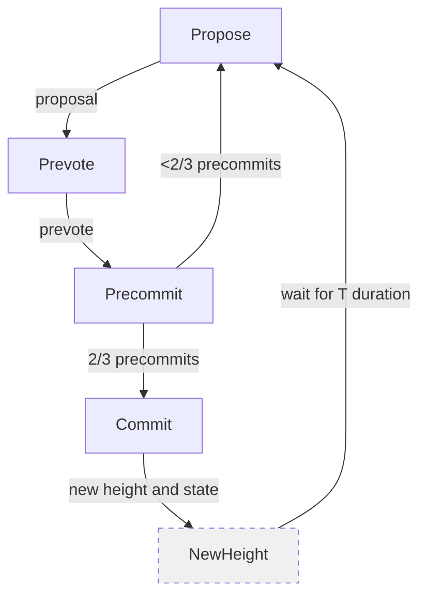
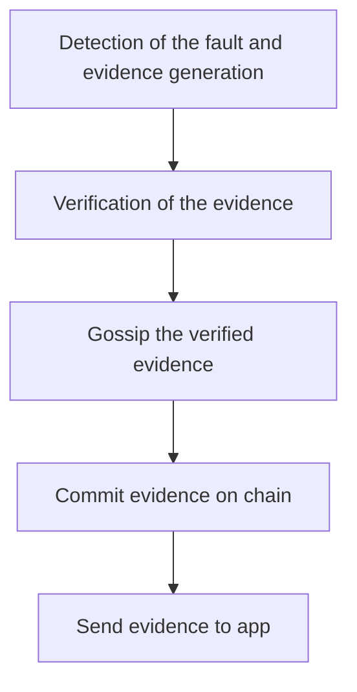

# Tendermint Proposer Election

Tendermint is a pure proof-of-stake based protocol that secures consensus on the blockchain. As Tendermint is a “leader-based protocol”, the proposer selection is critical for its correct functioning. We also will refer to this "leader" as a "proposer" because is the actor that proposes the next block to be voted by all the other validators.

## Two-chain commit process

## Brief explanation

At its core, the proposer selection procedure uses a weighted round-robin algorithm. It works similarly to a priority queue (or binary heap). The priority is given by what is called "accumulation". Every validator has its own accumulation and it is affected round by round by something called "voting power" and it works in the same way as the "stake" in other protocols. With greater staked coins, the greater the voting power that the validator has. 

Before we explain how the algorithm works, we need to introduce some nomenclature:

- Let $\mathcal{V}^{r}$ be set of validators in the round $r$ network.
- Let $acc_{v}^{r}$ be the accumulator of validator $v$  in the round $r$ $\forall{v}\in\mathcal{V}$ which represents the priority for $v$ to be selected as a proposer such that 
$$
acc_{v}^{r} = \left\{
                \begin{aligned}
                    &vp_{v}^{1} &r=1 &\quad (1) \\
                    &-1.125 \cdot vp_{tot}^{r} &r>1, v\in\mathcal{V}^{r}, v\notin\mathcal{V}^{r-1} &\quad (2)\\
                    &acc_{v}^{r-1} + vp_{v}^{r} &r>1,\,v\neq{p_{r}} &\quad (3)\\
                    &acc_{v}^{r-1} - vp_{tot}^{r} + vp_{v}^{r} &r>1,\,v=p_{r} &\quad (4)\\
                \end{aligned}
               \right.
$$

    where $vp_{tot}^{r}$ is the total voting power of the round $r$ such that $$vp_{tot}^{r} = \sum_{v\in\mathcal{V}^{r}}vp_{v}^{r}, \quad (5)$$ $vp_{v}^{r}$ is round's $r$ voting power of validator $v$ and $p_{r}$ is the proposer of round $r$ such that $$p_{r} = \underset{v\in\mathcal{V}^{r}}{\operatorname{arg\,max}}\{acc_{v}^{r}\}. \quad (6)$$

With this in mind, the basic algorithm works as follows:

Initialize $\mathcal{V}$ with every validator $v\in\mathcal{V}$ with a voting power $vp_{v}$ and an accumulator $acc_{v} = 0$ which represents the priority.
2. The accumulator $acc_{v}$ of each validator $v\in\mathcal{V}\backslash\{p_{r}\}$ who is not the proposer $p_{r}$ is incremented by its voting power (see $(3)$).
3. The validator with the greatest accumulator is elected as the proposer of that round (see $(6)$).
4. When the round $r$ is finished the accumulator of the proposer $acc_{p_{r}}^{r}$ is decreased by the total voting power on the network that is the sum of all the individual voting powers (see $(4)$).
5. Repeat from step 2 for the next round.
6. Validators that are part of the set of validators of round $r$ but are not part of the set of validators of round $r-1$ are added with the lowest priority (see $(2)$).

## Toy Example

- Assumptions for this example:
    - $\mathcal{V}^{r} = \mathcal{V}^{r+1}, \,\forall{r}\in{\mathbb{N}\backslash\{0\}}$.
    - $vp_{v}^{r} = vp_{v}^{r+1}, \,\forall{r}\in{\mathbb{N}\backslash\{0\}}, \, \forall{v}\in\mathcal{V}$.
- $\mathcal{V}^{r} = \{a, b, c, d, e, f, g, h, i\}$.

- The $vp_{v}$ with $v\in\mathcal{V}$ is defined as follows:

| $v$ | $a$ | $b$ | $c$ | $d$ | $e$ | $f$ | $g$ | $h$ | $i$ |
| - | - | - | - | - | - | - | - | - | - |
| $vp_{v}$ | 87 | 69 | 61 | 46 | 55 | 53 | 50 | 23 | 32 |

- The accumulation $acc_{v}^{r}$ $\forall{v}\in\mathcal{V}$ evolves as follows (bold $acc_{v}^{r}$ means that $acc_{v}^{r} = acc_{p_{r}}^{r}$):

| Round $r$ | a | b | c | d | e | f | g | h | i | $acc_{tot}$ |
| - | - | - | - | - | - | - | - | - | - | - |
| 1 | **87** | 69 | 61 | 46 | 55 | 53 | 50 | 23 | 32 | 476 |
| 2 | -302 | **138** | 122 | 92 | 110 | 106 | 100 | 46 | 64 | 476 |
| 3 | -215 | -269 | **183** | 138 | 165 | 159 | 150 | 69 | 96 | 476 |
| 4 | -128 | -200 | -232 | 184 | **220** | 212 | 200 | 92 | 128 | 476 |
| 5 | -41 | -131 | -171 | 230 | -201 | **265** | 250 | 115 | 160 | 476 |
| 6 | 46 | -62 | -110 | 276 | -146 | -158 | **300** | 138 | 192 | 476 |
| 7 | 133 | 7 | -49 | **322** | -91 | -105 | -126 | 161 | 223 | 476 |
| 8 | 220 | 76 | 12 | -108 | -36 | -52 | -76 | 184 | **256** | 476 |
| 9 | **307** | 145 | 73 | -62 | 19 | 1 | -26 | 207 | -188 | 476 |

- Leader history board

| $r$ | 1 | 2 | 3 | 4 | 5 | 6 | 7 | 8 | 9 |
| --- | - | - | - | - | - | - | - | - | - |
| $p_{r}$ | $a$ | $b$ | $c$ | $d$ | $e$ | $f$ | $g$ | $h$ | $a$ |

- Leader board

| Validators | $a$ | $b$ | $c$ | $d$ | $e$ | $f$ | $g$ | $h$ | $i$ |
| --- | - | - | - | - | - | - | - | - | - |
| **Times elected** | 2 | 1 | 1 | 1 | 1 | 1 | 1 | 1 | 0 |

## End of epoch update

The validator set can only be updated at the end of an epoch. The update request made in block $h$ will take effect at block $h+2$. The validator set update can mean to add, remove or update a validator's voting power.

### Validator Update

- Let $VU_{v}^{r}$ be the validator update request sent in round $r$ that updates the voting power of validator $v$ by $vp$ that takes effect in round $r+2$ such that $$VU_{v}^{r} = \langle v, r, vp \rangle, \quad{vp\geq0}$$
then

$$
\begin{align}
    vp_{v}^{r+2} &= vp &\quad (1)\\
    acc_{v}^{r+2} &= -1.125 \cdot vp_{tot}^{r+2}
\end{align}
$$

<!-- - $VU_{v}^{r}$ can add a new validator the set, remove a validator from the existing set, and update an existing validator's voting power depending on the voting power especified in the request. -->

- $VU_{v}^{r}$ affects the validator set $\mathcal{V}$ in round $r+2$ such that

$$
\mathcal{V}^{r+2} = \left\{
            \begin{aligned}
                &\mathcal{V}^{r}\backslash{\{v\}} &vp = 0, v\in\mathcal{V}^{r} &\quad (2)\\
                &\mathcal{V}^{r}\cup{\{v\}} &vp > 0, v\notin\mathcal{V}_{r} &\quad (3)\\
                &\mathcal{V}^{r} &vp > 0, v\in\mathcal{V}^{r}\,\vee\, vp = 0, v\notin\mathcal{V}_{r} &\quad (4)\\
            \end{aligned}
        \right.
$$

- Validator $v$ is removed from the validator set $\mathcal{V}^{r+2}$ iff $vp = 0$ in $VU_{v}^{r}$ (see $(2)$).
- Validator $v$ is added to the validator set $\mathcal{V}^{r+2}$ iff $vp\gt0$ in $VU_{v}^{r}$ (see $(3)$).
- The validator set $\mathcal{V}^{r+2}$ remains unchanged if in $VU_{v}^{r}$, $vp = 0$ and $v$ didn't belong to the set in round $r$ or if $vp>0$ and $v$ already belong to the set in round $r$ (see $(4)$). In the latter case, only $vp_{v}^{r+2}$ is updated (see $(1)$).

## Punishment

Tendermint uses [Evidence](https://github.com/tendermint/tendermint/blob/master/spec/consensus/evidence.md) to identify validators who have or are acting maliciously. But still, Tendermint does not punish bad actors, this is left to the discretion of the application built on top of the network. There are multiple types of evidence:

- **Duplicate vote evidence**: This happens when a validator tries to convince some subset of nodes to commit one block whilst convincing another subset to commit a different block. 
- **Light client attack evidence**: It is the generalized evidence that captures all forms of known attacks on a light client such that a full node can verify, propose and commit the evidence on-chain for the punishment of the malicious validators.

The process goes as follows:

[When a fault is detected](https://github.com/tendermint/tendermint/blob/master/spec/consensus/evidence.md#detection) then evidence of that fault is generated. This evidence can be of a double vote or a light client attack. After the evidence is created it is sent to the peers of the node that generated it. If a node receives evidence [it needs to verify it](https://github.com/tendermint/tendermint/blob/master/spec/consensus/evidence.md#verification) and if it is valid, it [gossips it continuously until it is on-chain or expires](https://github.com/tendermint/tendermint/blob/master/spec/consensus/evidence.md#gossiping). Evidence transactions take strict priority over regular transactions so the transactions will take the remaining space of the block. Validators receiving blocks with evidence will validate the evidence before voting. After evidence is committed [the evidence is sent to the application](https://github.com/tendermint/tendermint/blob/master/spec/consensus/evidence.md#sending-evidence-to-the-application).

- [More on light client attacks valdation](https://github.com/tendermint/tendermint/blob/master/spec/light-client/verification/verification_001_published.md).
- [More on light client attacks detector](https://github.com/tendermint/tendermint/blob/master/spec/light-client/detection/detection_003_reviewed.md).

### Misbehaviour of validators

Forks are the result of faulty validators deviating from the protocol. In principle several such deviations can be detected without a fork actually occurring:

1. **Double proposal**: A faulty proposer proposes two different values (blocks) for the same height and the same round in Tendermint consensus.
2. **Double signing**: Tendermint consensus forces correct validators to prevote and precommit for at most one value per round. In case a faulty validator sends multiple prevote and/or precommit messages for different values for the same height/round, this is a misbehavior.
3. **Lunatic validator**: Tendermint consensus forces correct validators to prevote and precommit only for values v that satisfy valid(v). If faulty validators prevote and precommit for v although valid(v)=false this is misbehavior.

Remark. In isolation, Point 3 is an attack on validity (rather than agreement). However, the prevotes and precommits can then also be used to forge blocks.

4. **Amnesia**: Tendermint consensus has a locking mechanism. If a validator has some value v locked, then it can only prevote/precommit for v or nil. Sending prevote/precomit message for a different value v' (that is not nil) while holding lock on value v is misbehavior.
5. **Spurious messages**: In Tendermint consensus most of the message send instructions are guarded by threshold guards, e.g., one needs to receive 2f + 1 prevote messages to send precommit. Faulty validators may send precommit without having received the prevote messages.

- [Attack scenarios](https://github.com/tendermint/tendermint/blob/master/spec/light-client/accountability/README.md#attack-scenarios).

---

- [Tendermint Proposer Selection Procedure](https://docs.tendermint.com/master/spec/consensus/proposer-selection.html)
- [Tendermint: Consensus without mining](https://tendermint.com/static/docs/tendermint.pdf)
- [Forum answer with a great example of proposer election in Tendermint](https://forum.cosmos.network/t/how-are-frequency-of-getting-selected-as-a-proposer-and-voting-power-relate-or-do-they/704/3)
