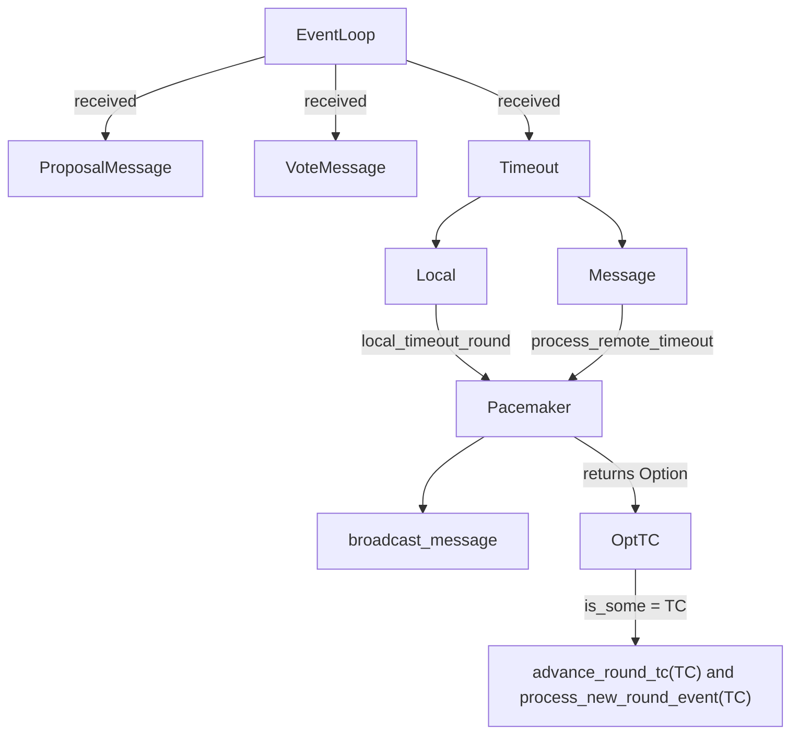

# Formal Verifications

## DiemBFT Formal Verification

### Formal Verification
No formal verifications of DiemBFT were found in the literature. However, there is a [tla+ spec written](https://www.shs-conferences.org/articles/shsconf/abs/2021/04/shsconf_nid2020_01006/shsconf_nid2020_01006.html) for HotStuff, which DiemBFT takes some inspiration from.

### Glossary
- Coinbase Transaction
- Request
- Validator
- Prover
- Leader
- Transaction Mempool
- Proving Pool
- Bucket

### First Iteration

Now we consider a reduced version of the proposed system. We'll model the system first with state diagrams and then using tla+.

### Iteration 0 (modeling a single node)

This is the most basic model we could think of, since we ignore the existence of other validators and instead only focus in a single node. For now the node will either receive QCs or TCs (assuming voting is automatic)

#### QCs only

First we keep track of the following variables:
- `round`: the current round considered by the node
- `QCs`: The set of received QCs
- `nodeState`: a map from rounds to the state of the node in the round.

The Next state transition predicate consists in checking if there exists a QC such that it can be added to the node.

#### Adding TCs

To understand how introducing TCs affects the current setup we tried to summarize the timeout flow presented in the DiemBFT paper into this:

This seems a bit extra. However, reading further into the paper you see that the only relevant thing to our model is that in case of receiving a TC you need to update the round number. We also keep track of the latest TC's round for further use.
